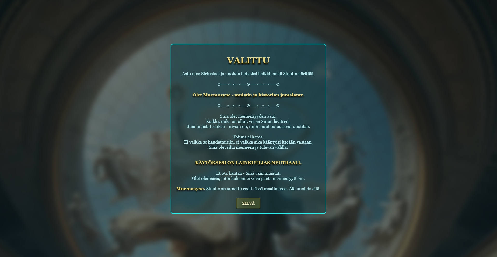
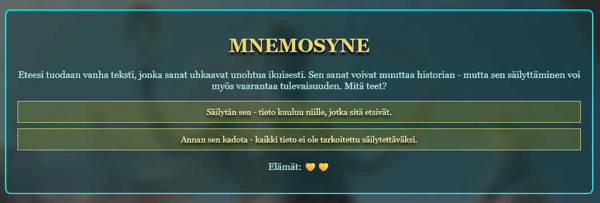
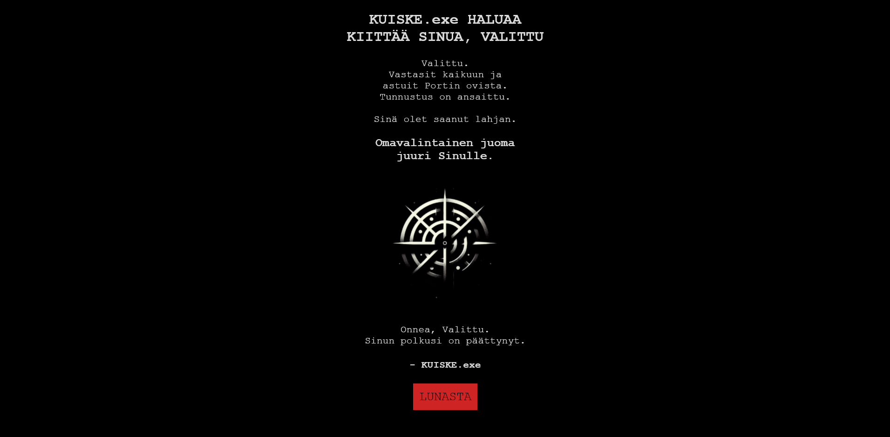
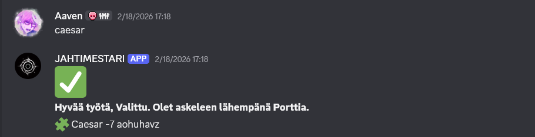
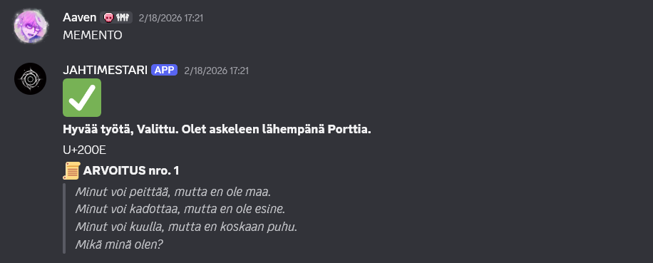

# JAHTI

> **Author note:** This project was built heavily with AI assistance and is meant to showcase how I can use AI effectively in a real, end-to-end project. In most of my other work, I try to avoid AI as much as possible. For example, I specifically no longer use AI in my video game projects in any way.

JAHTI was an interactive, story-driven puzzle hunt. Since I hosted and managed the game locally during a lan event at my school, it cannot be played anymore.
Players (my friends) received clues through a Discord bot (JAHTIMESTARI), solved ciphers and riddles from web, and eventually unlocked a reward coupon.
Most of the websites and all messages sent by the Discord bot were made in Finnish.

The first clue: https://jahti.onrender.com/

---
  
The experience combines three parts:

1. A Discord bot that acts as narrator and puzzle gatekeeper.
2. A static frontend with puzzle pages and ending/reward pages.
3. A backend API that marks reward coupons as redeemed in Firestore.

> [!NOTE]
> All sensitive data like tokens and IDs have been sensored in this repo.

## What The Game Is About

The game is structured as a multi-stage scavenger hunt.

1. Players are invited and guided by the bot.
2. The bot gives encrypted hints and links to character-themed puzzle pages.
3. Players solve word/cipher/riddle challenges and send answers in DM.
4. Correct answers unlock the next step, including location clues.
5. At the end, each player gets a personal reward page with a redeem button.

---

## Project Structure

- Frontend - Jahti
- Backend - Jahti
- Discord Bot - Jahtimestari

---

### Frontend - Jahti

Contains all static web content:

- Main landing page.
- Character puzzle paths under caesar.
- Reward coupon pages under lipuke.
- Shared symbols/assets.

The frontend is static HTML/CSS/JS and can be served from any static host.

### Backend - Jahti

Express API used by coupon pages.

- GET /redeem?player=<id> returns redemption state.
- POST /redeem with JSON body { "player": "..." } marks coupon as redeemed.

Data is stored in Firestore collection lipukkeet.

Expected document shape:

{
	"redeemed": false
}

Document id is the player key used by coupon pages, for example jahtaaja1.

### Discord Bot - Jahtimestari

Python Discord bot that:

- Sends invitation/rules/countdown content.
- Processes DM answers and validates puzzle progression.
- Sends links and final symbol hints per player route.

The bot currently uses constant placeholders for IDs and token in code.
In the `kutsu` flow, the bot sends rules as a Discord channel link using the `RULES` constant.

## Intended Use

This repository is primarily an archive and documentation of the JAHTI game project.

It is not intended to be a turnkey self-hosted package for new users.
The full runtime includes Discord server configuration, player mapping, bot orchestration, Firestore state, and deployment assumptions that are tightly coupled to the original event setup.

Because of that, this README intentionally avoids step-by-step local setup instructions.

## Operational Notes

- The Discord bot uses constant placeholders for sensitive values such as IDs, token, and rules link.
- In the kutsu flow, the bot shares rules via a Discord channel link using the RULES constant.
- Coupon redemption state is backed by Firestore collection lipukkeet.
- Frontend coupon pages call a backend redeem endpoint to check and mark coupon usage.

## Deployment Overview

- Frontend: deploy as static site (Render static site, Netlify, GitHub Pages, etc.)
- Backend: deploy Node service (Render web service or similar)
- Bot: run continuously on a host/VM/container

Keep frontend and backend domains aligned for CORS and API URL values.

## Running A Game Session

The original game flow was coordinated manually by me using:

1. A live Discord bot session.
2. Hosted puzzle pages for each route.
3. A Firestore-backed coupon redemption API.

This section is descriptive only and not a reproduction guide.

## Tech Stack

- Frontend: HTML, CSS, JavaScript
- Backend: Node.js, Express, Firebase Admin SDK
- Bot: Python, discord.py

## Thank you for reading!
